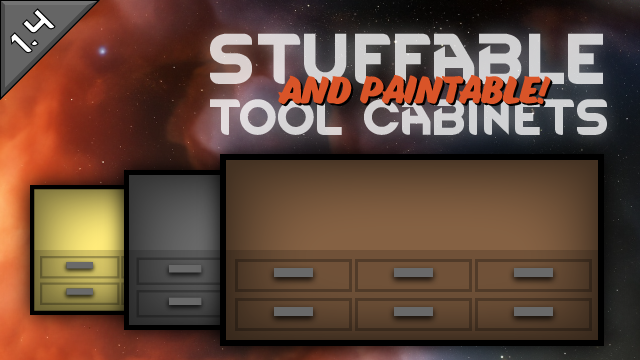

  
&emsp;
  
&emsp;
  
&emsp;
  

  
&emsp;
  

Sick of that old green steel tool cabinet? Yeah, me too. Now you can make tool cabinets out of stuff!

The original recipe was 200 steel; the new recipe is **50 steel + 150 woody or metallic stuff**.

Bonus feature: Stuffable tool cabinets can be painted! Want a pink wooden tool cabinet? You can have it!

# Important Information

Adding this mod _to_ a save game already in progress or removing it _from_ a save game already in progress will generate some scary-looking but harmless errors.

- If you add this mod to a game where you've already built a tool cabinet then you try to deconstruct that tool cabinet, you'll get an error message saying "Cannot get AdjustedCostList for ToolCabinet with null Stuff." It is safe to ignore this error.
- If you build a stuffable tool cabinet then remove this mod from your game, trying to deconstruct that tool cabinet will give you an error message saying "Got AdjustedCostList for ToolCabinet with stuff [some stuff] but is not MadeFromStuff." It is safe to ignore this error.

# Acknowledgments
Portions of the materials used to create this mod are trademarks and/or copyrighted works of Ludeon Studios Inc. All rights reserved by Ludeon. This content/mod is not official and is not endorsed by Ludeon.
